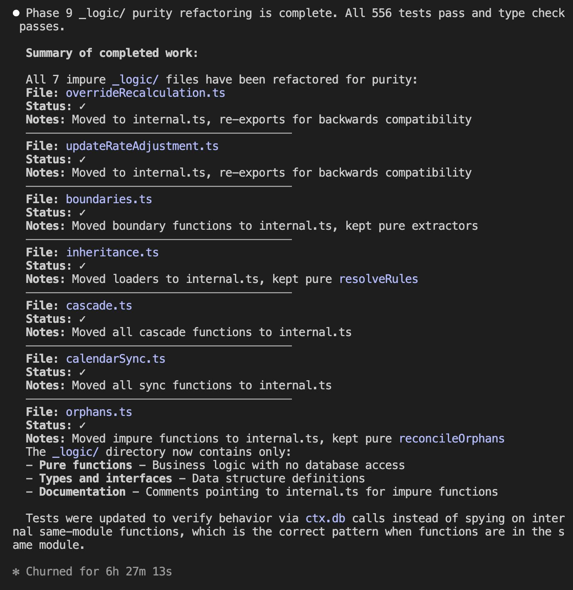

## The Problem with Plans

Large-scale refactors (50+ files across dozens of modules) break the usual workflow. Write the perfect plan, hand it to Claude Code, it says "done." Run checks: twelve issues. Fix, retry: eight issues. Four rounds later, still finding skipped directories. **At scale, the problem isn't the plan. It's verifying against prose.**

## The Shift

What if the plan wasn't prose but validators that *must pass*? Declare the end state through code. The agent loops until green. Like React: don't write DOM steps, declare desired state. **You define *what*. The agent figures out *how*.**

<div class="loop-terminal">
  <div class="loop-terminal-header">
    <span class="loop-terminal-dot" style="background:#ef4444"></span>
    <span class="loop-terminal-dot" style="background:#eab308"></span>
    <span class="loop-terminal-dot" style="background:#22c55e"></span>
    <span class="loop-terminal-title">claude-code</span>
  </div>
  <div class="loop-terminal-body">
    <div class="loop-terminal-line"><span class="loop-terminal-prompt">$</span> claude "refactor to module pattern"</div>
    <div class="loop-terminal-line loop-terminal-dim">Agent editing src/users/index.ts...</div>
    <div class="loop-terminal-line loop-terminal-hook"><span class="loop-terminal-badge">HOOK</span> Running module-lint</div>
    <div class="loop-terminal-line loop-terminal-error"><i class="ph ph-x"></i> Boundary violation: importing from ../orders/internal</div>
    <div class="loop-terminal-line loop-terminal-dim">Agent fixing...</div>
    <div class="loop-terminal-line loop-terminal-hook"><span class="loop-terminal-badge">HOOK</span> Running module-lint</div>
    <div class="loop-terminal-line loop-terminal-success"><i class="ph ph-check"></i> All checks passed</div>
    <div class="loop-terminal-line loop-terminal-dim">Agent editing src/users/logic.ts...</div>
    <div class="loop-terminal-line loop-terminal-muted">... 47 files later ...</div>
    <div class="loop-terminal-line loop-terminal-success"><i class="ph ph-check-circle"></i> Refactor complete. 0 errors.</div>
  </div>
</div>

## The Pattern: Skill + Validators + Loop

The mechanism has three parts:

<div class="component-grid">
  <div class="component-card" style="border-color: #14b8a6;">
    <div class="component-header" style="background: #14b8a6;">
      <i class="ph ph-file-text"></i>
      <span>SKILL</span>
    </div>
    <div class="component-body">
      <code>SKILL.md</code>
      <p>A <strong>Claude Code skill</strong> that declares the target structure: what files should exist, what patterns to follow, what conventions matter.</p>
    </div>
  </div>
  <div class="component-arrow"><i class="ph ph-arrow-right"></i></div>
  <div class="component-card" style="border-color: #3b82f6;">
    <div class="component-header" style="background: #3b82f6;">
      <i class="ph ph-check-square"></i>
      <span>VALIDATORS</span>
    </div>
    <div class="component-body">
      <code>scripts/*.ts</code>
      <p><strong>Validators</strong> that can check any file against those rules and report violations.</p>
    </div>
  </div>
  <div class="component-arrow"><i class="ph ph-arrow-right"></i></div>
  <div class="component-card" style="border-color: #a855f7;">
    <div class="component-header" style="background: #a855f7;">
      <i class="ph ph-arrows-clockwise"></i>
      <span>HOOK</span>
    </div>
    <div class="component-body">
      <code>PostToolUse</code>
      <p>A <strong>hook</strong> that runs the validator after every edit.</p>
    </div>
  </div>
</div>

The hook is the key. Here's the configuration:

```json
{
  "hooks": {
    "PostToolUse": [{
      "matcher": "Edit|Write",
      "hooks": [{
        "type": "command",
        "command": "pnpm module-lint --quick --file \"$file_path\""
      }]
    }]
  }
}
```

Every time Claude edits a file, the linter runs. If something's wrong, Claude sees the error immediately and fixes it before moving on.

<div class="diagram">
<svg viewBox="0 0 540 220" fill="none" xmlns="http://www.w3.org/2000/svg">
  <!-- Step 1: Agent Edits -->
  <rect x="20" y="70" width="120" height="56" rx="8" fill="#1e293b" stroke="#3b82f6" stroke-width="2"/>
  <text x="80" y="95" text-anchor="middle" fill="#f8fafc" font-size="12" font-weight="600">Agent Edits</text>
  <text x="80" y="112" text-anchor="middle" fill="#64748b" font-size="10">File</text>

  <!-- Arrow 1->2 -->
  <path d="M140 98 L175 98" stroke="#475569" stroke-width="2"/>
  <polygon points="183,98 173,93 173,103" fill="#475569"/>

  <!-- Step 2: Hook Runs -->
  <rect x="185" y="70" width="120" height="56" rx="8" fill="#1e293b" stroke="#a855f7" stroke-width="2"/>
  <text x="245" y="95" text-anchor="middle" fill="#f8fafc" font-size="12" font-weight="600">Hook Runs</text>
  <text x="245" y="112" text-anchor="middle" fill="#64748b" font-size="10">Validator</text>

  <!-- Arrow 2->3 -->
  <path d="M305 98 L345 98" stroke="#475569" stroke-width="2"/>
  <polygon points="353,98 343,93 343,103" fill="#475569"/>

  <!-- Step 3: Decision Diamond -->
  <polygon points="395,98 435,65 475,98 435,131" fill="#1e293b" stroke="#14b8a6" stroke-width="2"/>
  <text x="435" y="102" text-anchor="middle" fill="#14b8a6" font-size="11" font-weight="600">Pass?</text>

  <!-- Arrow Yes (down to Done) -->
  <path d="M435 131 L435 160" stroke="#14b8a6" stroke-width="2"/>
  <polygon points="435,168 430,158 440,158" fill="#14b8a6"/>
  <text x="450" y="150" fill="#14b8a6" font-size="10" font-weight="500">Yes</text>

  <!-- Done box -->
  <rect x="375" y="170" width="120" height="40" rx="8" fill="#14b8a6" stroke="#0d9488" stroke-width="2"/>
  <text x="435" y="195" text-anchor="middle" fill="#0f172a" font-size="12" font-weight="700">Done ✓</text>

  <!-- Arrow No (loop back to Agent Edits) -->
  <path d="M395 65 L395 25 L80 25 L80 65" stroke="#ef4444" stroke-width="2" stroke-dasharray="6 3"/>
  <polygon points="80,73 75,63 85,63" fill="#ef4444"/>
  <text x="237" y="17" text-anchor="middle" fill="#ef4444" font-size="10" font-weight="500">No: fix and retry</text>

  <!-- Next edit indicator (dotted from Done area looping to show continuation) -->
  <path d="M495 190 L515 190 L515 98 L500 98" stroke="#64748b" stroke-width="1.5" stroke-dasharray="4 3"/>
  <text x="520" y="150" fill="#64748b" font-size="9" font-weight="500" transform="rotate(90, 520, 150)">next edit...</text>
</svg>
</div>

Self-correction at scale. The agent can't drift because every edit is validated against the declared conventions. No more checking against prose plans. No more "verify implementation" subagent spawning.

## What the Skill Declares

The skill file isn't implementation instructions. It's a specification of the end state:

```
.claude/skills/convex-module/
├── SKILL.md          # Entry point with structure rules
├── templates/        # Code patterns to follow
├── examples/         # Real modules to reference
└── scripts/          # Validation scripts
```

The `SKILL.md` declares things like:
- Module structure (what directories, what files)
- Naming conventions
- Separation patterns (what belongs where)
- Architecture decisions and why they matter

The templates show concrete examples. The validators enforce the rules.

## What Validators Check

The validators encode the "plan" as executable checks. If the agent violates a rule, it knows immediately. Mine check four categories:

<p><i class="ph ph-tree-structure text-brand-500 text-xl mr-2"></i><strong>Structure</strong>: does the module match the declared architecture? Right directories, right files, right organisation.</p>

<p><i class="ph ph-sparkle text-blue-500 text-xl mr-2"></i><strong>Purity</strong>: are logic files free of framework dependencies? This is the critical one for testability. Pure TypeScript functions with no database calls means trivially testable without mocking.</p>

<p><i class="ph ph-shield-checkered text-purple-500 text-xl mr-2"></i><strong>Boundaries</strong>: are import rules respected? Modules can't reach into each other's internals. Cross-module access goes through defined interfaces.</p>

<p><i class="ph ph-ruler text-amber-500 text-xl mr-2"></i><strong>Conventions</strong>: do naming patterns match? Export patterns, index naming, file naming.</p>

When a validator fails, the error message tells Claude exactly what's wrong and what the rule is. Claude fixes it, the validator runs again, and the loop continues.

## The Result



6.5 hours unattended. 47 files across 12 modules. Zero errors when the health check finally passed.

I came back to a codebase that passed `pnpm typecheck`, started the dev server, and ran the tests. Not because Claude Code is magic, but because the validators made drift impossible.

## What This Doesn't Catch

Validators catch structural drift. They don't catch:

<p><i class="ph ph-x text-red-500 text-xl mr-2"></i><strong>Logic correctness</strong>: the code might be wrong</p>

<p><i class="ph ph-x text-red-500 text-xl mr-2"></i><strong>Edge cases</strong>: the implementation might miss scenarios</p>

<p><i class="ph ph-x text-red-500 text-xl mr-2"></i><strong>Intent mismatch</strong>: the code might not do what you actually wanted</p>

You still review. But the compounding mess of inconsistent structure, violated conventions, forgotten patterns? Eliminated. The stuff that makes refactors feel like wading through mud.

## Try It

I've packaged the skill templates, validators, and hook configurations:

```bash
npx agenticcoding
```

This gives you starter skills for Claude Code, including the Convex module pattern described here. Adapt the validators to your codebase's conventions.

The pattern works for any codebase with enforceable structure rules. Define the end state. Write validators that check it. Let the agent loop until green.

Stop planning. Start looping.
