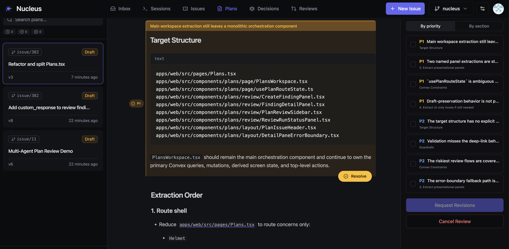
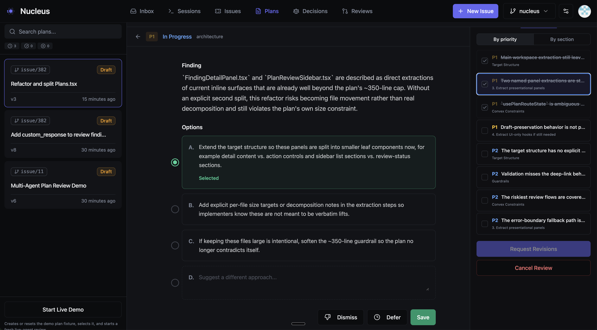

# Stop Reviewing Code. Start Reviewing Plans.

What started as a small Sunday morning exploration escalated... rapidly.

I spend around 50% of my time planning. That sounds like a lot, and it is. But here's why it compounds: a single design decision made up front — which pattern to use, how to handle partial failures, whether a step needs idempotency — prevents hours of rework downstream. The best way to avoid bad code is to be explicit about implementation detail before you write any.

The thing I didn't expect? Agents are better at reviewing plans than I am. I don't have the patience for that level of scrutiny across a 200-line plan — checking every edge case, every API contract, every assumption about state. And I don't need to. If I run multiple review rounds with different agents, I end up with a watertight plan: every edge case addressed, every API call specified, every failure mode documented. That plan can then be executed with far fewer bugs.

So I built an end-to-end workflow that automates agent review and improvement, while keeping me in the loop for the decisions that actually matter.

## Why Plans Over Code

It's much easier to review and iterate on a single markdown file than on code spread across your repo. A plan is a compressed representation of intent — you can read it in five minutes, spot structural problems immediately, and rewrite entire sections without touching a test suite.

Code review happens after the damage is done. By the time you're looking at a PR, the architecture is set, the abstractions are chosen, and the reviewer is mostly checking for typos and missed edge cases. Plan review happens when it's still cheap to change direction.

This is the fundamental insight: **the plan is the right unit of collaboration between humans and agents.** Humans are good at strategic decisions — should we use WebSockets or polling? Is this feature worth the complexity? Agents are good at exhaustive detail — did you handle the error case on line 47? Is this API call idempotent? Reviewing plans plays to both strengths.

## The Workflow

I use my own orchestrator called Nucleus, which runs with a web UI, local runners (OpenClaw style, without the security issues), and data/functions/workflows in Convex.

  <!-- Step 1 -->
  

    <i class="ph ph-file-text" style="color:#14b8a6;font-size:1.2rem;flex-shrink:0;"></i>
    Plan written
    <code style="margin-left:auto;font-size:0.7rem;color:#64748b;background:#0f172a;padding:0.15rem 0.4rem;border-radius:0.25rem;border:1px solid #334155;">.agent/plans/</code>
  

  <!-- Arrow -->
  
<i class="ph ph-arrow-down" style="font-size:1rem;"></i>

  <!-- Step 2 -->
  

    <i class="ph ph-broadcast" style="color:#14b8a6;font-size:1.2rem;flex-shrink:0;"></i>
    File watcher
    syncs to Nucleus
  

  <!-- Arrow -->
  
<i class="ph ph-arrow-down" style="font-size:1rem;"></i>

  <!-- Step 3: Parallel -->
  

    

      
      

        
Codex

        
read-only

      

    

    

      
      

        
Claude Code

        
read-only

      

    

  

  <!-- Arrow -->
  
<i class="ph ph-arrow-down" style="font-size:1rem;"></i>

  <!-- Step 4 -->
  

    <i class="ph ph-funnel" style="color:#14b8a6;font-size:1.2rem;flex-shrink:0;"></i>
    Triage
    merge + prioritise findings
  

  <!-- Arrow -->
  
<i class="ph ph-arrow-down" style="font-size:1rem;"></i>

  <!-- Step 5: Human (highlighted) -->
  

    <i class="ph ph-user-circle" style="color:#14b8a6;font-size:1.3rem;flex-shrink:0;"></i>
    Human Review
    P0/P1 decisions
  

  <!-- Arrow -->
  
<i class="ph ph-arrow-down" style="font-size:1rem;"></i>

  <!-- Step 6 + 7 with loop -->
  

    

      

        <i class="ph ph-wrench" style="color:#14b8a6;font-size:1.2rem;flex-shrink:0;"></i>
        Remediation
        agent revises plan
      

      
<i class="ph ph-arrow-down" style="font-size:1rem;"></i>

      

        <i class="ph ph-check-circle" style="color:#14b8a6;font-size:1.2rem;flex-shrink:0;"></i>
        Verification
        check revisions land
      

    

    <!-- Loop indicator -->
    

      

      <i class="ph ph-arrow-u-up-left" style="color:#475569;font-size:0.85rem;"></i>
      
loop

    

  

Each step is durable so if an agent times out, or returns invalid json, the workflow picks up where it left off. Here's what each stage actually does and why it matters:

### 1. File Watch and Sync

When any agent writes a plan to `.agent/plans/`, a file system watcher detects the change, hashes the content to avoid redundant uploads, and syncs it to Nucleus. This happens automatically — the agent doesn't need to know about the review system. It just writes a plan and the review pipeline activates.

### 2. Parallel Review

A durable workflow fans out to multiple review agents — typically Codex and Claude Code — running in headless mode on my local runner. Each reviewer gets read-only access to the workspace, so they can cross-reference the plan against the actual codebase but can't modify anything.

Using different agents matters. They catch different things. Codex tends to be thorough on pure engineering and edge cases. Claude Code is better at spotting architectural issues and questioning assumptions. Running them in parallel means I get both perspectives without waiting.

### 3. Triage

Multiple reviewers generate overlapping findings. The triage agent consolidates them: same issue from multiple reviewers becomes a single finding with the best description and evidence. Distinct issues stay distinct, even if they're on adjacent lines.

Each finding gets a priority — P0 blocks shipping (incorrect, unsafe, will fail), P1 should be fixed (underspecified, fragile), P2 is worth improving (clarity, consistency), P3 is a nit. The triage agent also attaches evidence anchors: specific line ranges in the plan, code file references, or repo-wide observations.

### 4. Human Review

This is where I come in. The UI presents findings grouped by the plan section they relate to, with the highest-priority items surfaced first. For each finding, I can:

- **Select an option** — the triage agent provides up to three suggested fixes, ranked by recommendation
- **Dismiss** — if the finding is wrong or irrelevant
- **Defer** — if it's valid but not worth addressing now
- **Leave a note** — custom guidance for the remediation agent

In practice, I spend most of my time on P0s and P1s. P2s and P3s I usually defer back to the agent with a quick note. The whole review takes a few minutes because I'm making decisions, not doing analysis.

### 5. Remediation and Verification

My decisions get encoded into the findings — which option I selected, what I deferred, any notes I left. The remediation agent receives all of this along with the current plan, and produces a revised version with specific patches tied to each finding.

A verification agent then checks that the revisions actually address the findings. If blocking issues remain and we haven't hit the cycle limit, it loops back to remediation. In practice, most plans converge in one or two cycles.

## What a Finding Looks Like

This is the review system reviewing plans for its own development - a P1 caught while refactoring Plans.tsx. Each finding explains the issue, then offers ranked options. I pick one, dismiss it, defer it, or write a custom response. That's it - decisions, not analysis.

## Results

Since building this workflow, my experience has been:

- Plans that go through automated review produce noticeably fewer bugs during implementation. The kinds of issues that used to surface during code review get caught at the plan stage when they're cheap to fix.
- The human review step takes 5-10 minutes per plan. Most of that is P0/P1 decisions. P2s and P3s take seconds each.
- Most plans converge in 1-2 review cycles. Occasionally a plan with deep architectural issues needs 4-5.
- I spend less time in code review because the plan already addressed the detail-level concerns. Code review becomes primarily about whether the implementation matches the plan, which is a much simpler question.

I'm capturing all the performance data, and rapidly learning which models are better for what - not vibes, actual in-flight evaluations based on every issue flowing through my coding workflows.  Expect more on that soon.

## The Bigger Picture

The traditional development loop:

  

    
<i class="ph ph-x-circle"></i> Traditional

    

      Write codeReview codeFix codeReview again
    

  

The planning loop:

  

    
<i class="ph ph-check-circle"></i> Planning

    

      Write planReview planFix planWrite code
    

  

The second version moves the expensive iteration to where changes are cheap.

But the real shift is in what humans and agents each do. I'm not reviewing implementation detail — agents do that better than me. I'm making strategic decisions: is this the right approach? Is this complexity justified? Should we even build this? Those are questions that require business context, user empathy, and judgement. Agents don't have those. I do.

Plans are the interface between human judgement and machine thoroughness. If you're spending your review cycles staring at diffs, you're doing the part that agents are better at, and skipping the part that only you can do.